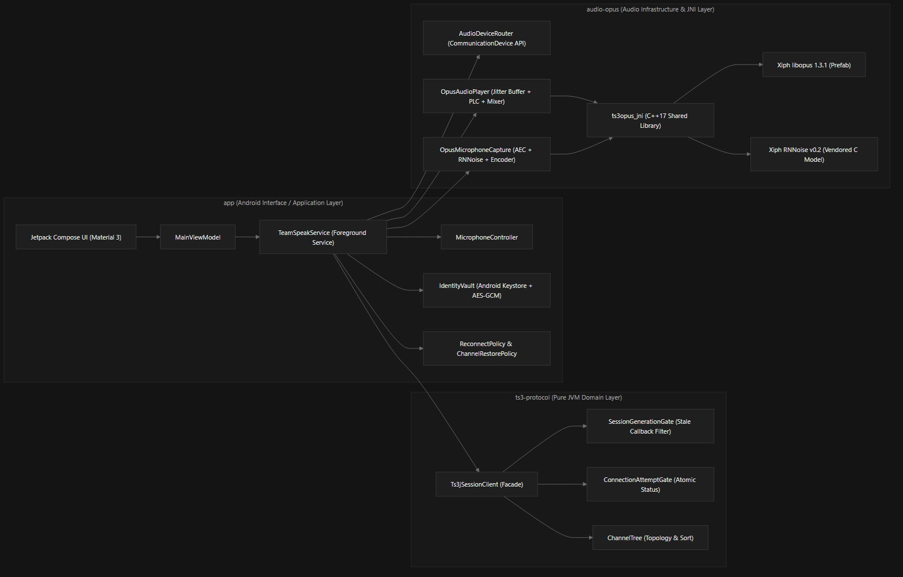
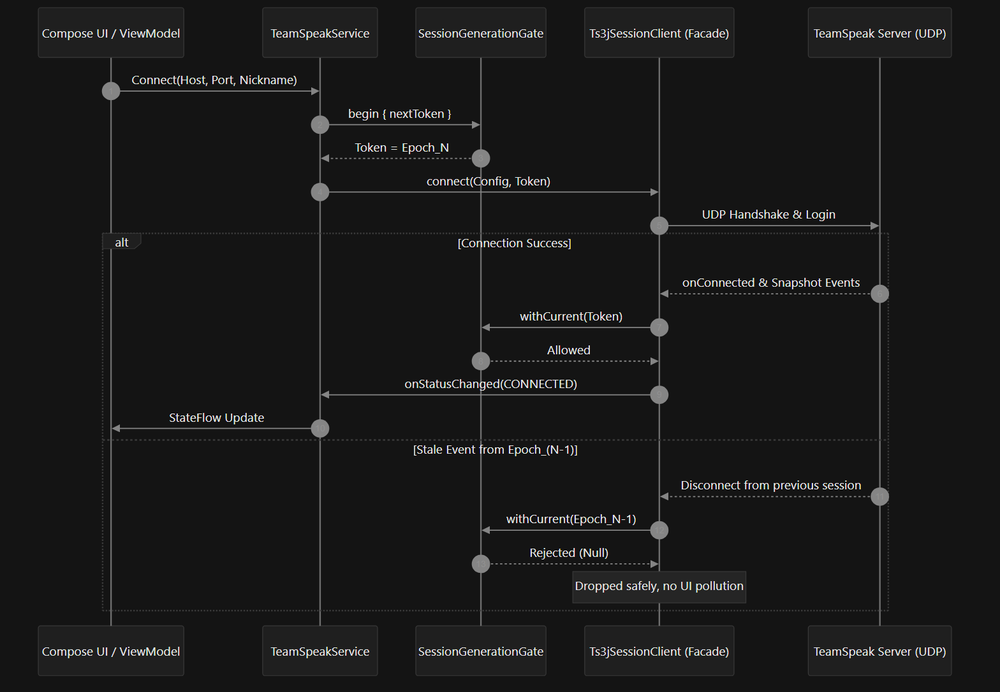
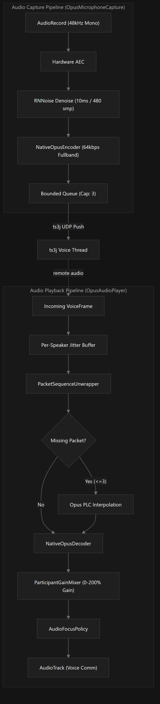
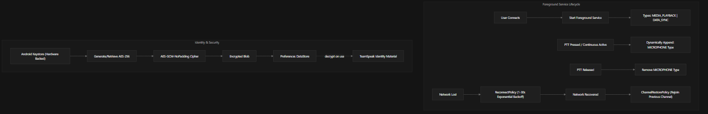
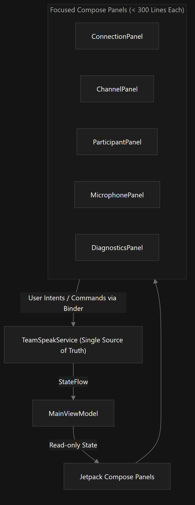

# TS3 Mobile — System Architecture Design Document (English Version)

---

## 1. System Overview

**TS3 Mobile** is an experimental, high-performance, open-source Android client for TeamSpeak 3, built on top of the [Manevolent/ts3j](https://github.com/Manevolent/ts3j) full-featured client protocol.

### Core Design Goals
- **Low Latency & High Fidelity**: Full-duplex voice communication utilizing official libopus and deep-learning RNNoise noise suppression.
- **Robust Protocol State Machine**: Thread-safe generational token gates preventing stale asynchronous UDP callbacks from corrupting UI state snapshots.
- **Strict Boundary Isolation**: Architectural adherence to `interface -> application -> domain -> infrastructure`, ensuring protocol and business logic are fully testable on a pure JVM without Android dependencies.
- **Zero Privacy Infiltration**: TeamSpeak identity private keys are encrypted with AES-GCM backed by the Android Keystore, with zero telemetry, analytics, or third-party tracking SDKs.

---

## 2. Overall Architecture & Module Boundaries



### Module Responsibilities Matrix

| Module | Architectural Layer | Technology Stack | Core Responsibilities |
| :--- | :--- | :--- | :--- |
| **`app`** | Android Interface & Application | Jetpack Compose, Coroutines/StateFlow, Android Keystore, Foreground Service | Compose UI rendering, ViewModel state distribution, Foreground Service orchestration, Keystore-backed identity vault, network-aware reconnection, and channel state restoration. |
| **`ts3-protocol`** | Pure JVM Domain & Facade | Kotlin JVM, ts3j Protocol, Coroutines | Protocol facade encapsulation, monotonic generation callback filtering, channel tree topology reconstruction, and privacy log sanitization (Zero Android SDK dependencies). |
| **`audio-opus`** | Audio Infrastructure & Native JNI | C++17, CMake, NDK, libopus, RNNoise, AudioTrack/AudioRecord | Native Opus encoding/decoding, 10ms neural denoising, per-speaker Jitter Buffer, Packet Loss Concealment (PLC), PCM software mixing, and communication audio routing. |

---

## 3. Subsystem Deep-Dive

### 3.1 Protocol & Concurrency Management



- **SessionGenerationGate**: Every connection attempt allocates a monotonically increasing epoch token. All asynchronous UDP callbacks (disconnections, channel updates, kicks) must validate their token against `withCurrent(token)`. Callbacks belonging to previous sessions are silently discarded, eliminating race-condition snapshot corruptions.
- **ConnectionAttemptGate**: Atomically synchronizes handshake timeouts, network exceptions, and `CONNECTED` state transitions, ensuring a failure state is never overwritten by a delayed success event.
- **ChannelTree Algorithm**: TeamSpeak servers structure channels via sibling linked-lists (`orderAfterId`). The algorithm performs depth-first tree traversal and linked-list reconstruction, gracefully handling circular references and broken orders, producing a flattened `ChannelRow` list for UI rendering.

---

### 3.2 Dual-Engine Low-Latency Audio Pipeline



1. **Opus Encoder Configuration**:
   - 48 kHz sampling rate, Mono, 20 ms frame length (960 samples), 64 kbps target bitrate;
   - Configured with `OPUS_APPLICATION_VOIP`, Fullband bandwidth, Complexity 10, and Constrained VBR.
2. **Deep-Learning Noise Suppression (RNNoise)**:
   - Source-vendored official Xiph RNNoise v0.2 model compiled with C99/C++17 optimizations (`-O3`);
   - Processes 10 ms chunks (480 samples) in-place while computing real-time Voice Activity Detection (VAD) probabilities to suppress ambient background noise.
3. **Bounded Queue Latency Protection**:
   - The microphone output queue is strictly limited to 3 frames (60 ms). Under network congestion, stale frames are discarded to prevent microphone latency buildup.
4. **Per-Speaker Jitter Buffer & Packet Loss Concealment (PLC)**:
   - Maintains isolated `TalkerState` for each remote speaker with an initial 60 ms hold to absorb jitter;
   - Uses `PacketSequenceUnwrapper` to handle 16-bit packet sequence wrap-around;
   - Invokes libopus PLC via `opus_decode(null)` when packet loss is ≤ 3 frames, avoiding audio clicks and dropouts.
5. **PCM Software Mixing & Independent Gain**:
   - Performs saturated addition mixing in 10 ms ticks (480 samples);
   - Supports 0%–200% volume gain per participant with clipping prevention (`clamp to [-32768, 32767]`).
6. **Communication Device Routing (`AudioDeviceRouter`)**:
   - Implements Android 12+ `setCommunicationDevice` APIs;
   - Retains legacy SCO Bluetooth and Speakerphone routing with automatic fallback upon device disconnection.

---

### 3.3 Android Lifecycle, Security & Services



- **Hardware-Backed Identity Vault (`IdentityVault.kt`)**: TeamSpeak client private identity keys are encrypted using AES-GCM with hardware-backed keys from the Android Keystore and stored in DataStore. Plaintexts are never persisted to disk or transmitted over the network.
- **Android 14+ Foreground Service Policy**: During standard connection, the service declares `mediaPlayback | dataSync`. The `microphone` foreground type is appended *only* while the user is actively speaking (PTT pressed or continuous transmit active), complying with Google Play requirements.
- **Network-Aware Reconnection (`ReconnectPolicy.kt`)**: Listens to `ConnectivityManager.NetworkCallback`. Pauses retry timers when offline and triggers immediate reconnection with 1–30s exponential backoff upon network restoration.
- **Channel State Memory & Restoration (`ChannelRestorePolicy.kt`)**: In-memory caching of the active channel ID and password; automatically rejoins the user's previous channel upon reconnection.

---

## 4. UI Architecture & Unidirectional Data Flow (MVI)



- **Unidirectional Data Flow**: `TeamSpeakService` acts as the single source of truth, exposing an immutable `TeamSpeakServiceState` via read-only `StateFlow`. UI surfaces only emit commands through the Service Binder.
- **Decomposed UI Surfaces**: Panels are separated into modular components under `app/src/main/java/io/github/ts3mobile/app/ui/`, each maintained strictly under 300 lines of code.

---

## 5. Engineering Quality Gates & Roadmap

```text
Build & Quality Gate Flow:
1. KtLint Formatting Check (:quality)
2. JVM Protocol & Algorithm Unit Tests (:ts3-protocol:test, :audio-opus:testDebugUnitTest, :app:testDebugUnitTest)
3. Android Lint Static Analysis (:app:lintDebug, :audio-opus:lintDebug)
4. CMake & NDK Native Shared Library Compilation (libts3opus_jni.so)
5. Connected Physical Device Tests (:audio-opus:connectedDebugAndroidTest)
```

| Dimension | Current Baseline (M10/M11) | Future Scope (Roadmap) |
| :--- | :--- | :--- |
| **Server Sessions** | Single-Server active connection | Multi-server tabs & concurrent multiplexing |
| **Voice Processing** | 48kHz Opus + RNNoise + Bounded Queue | Adaptive bitrate & VAD-based Voice Activation |
| **Channel & State** | Tree sorting & Auto channel restoration | Encrypted server bookmarks & token permission management |
| **Text & Transfer** | Pure Low-Latency Duplex Voice | Text chat channels, Whisper, and File Transfer protocol |

